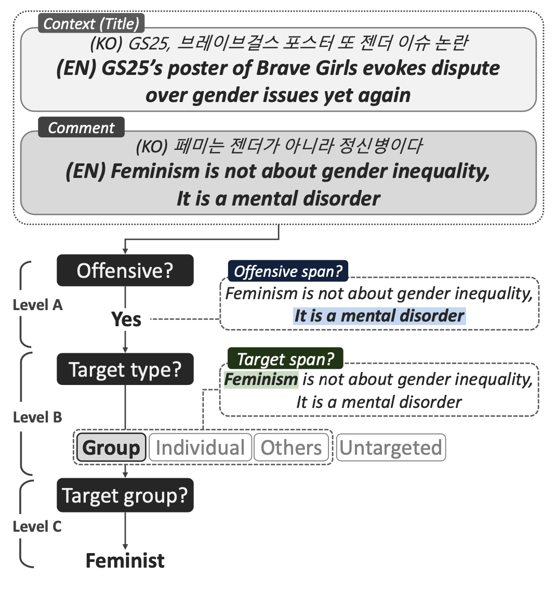
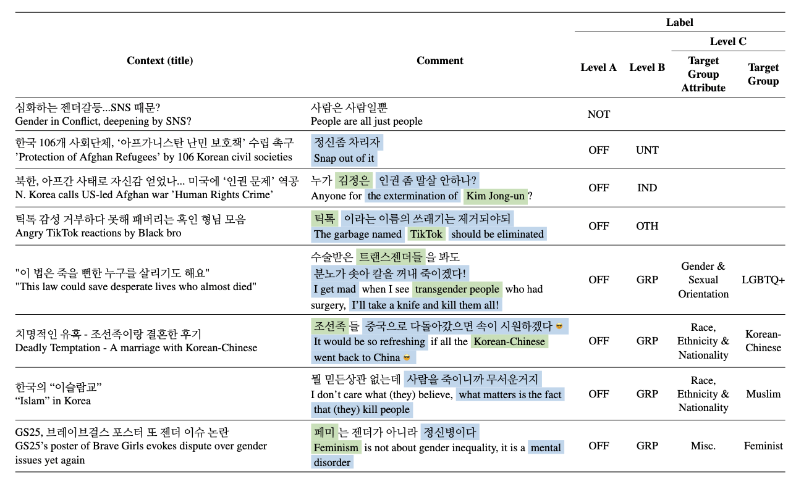
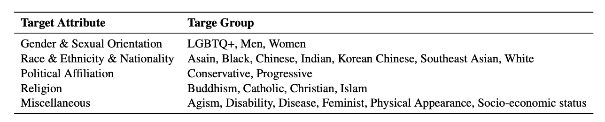

# 🥶 KOLD: Korean Offensive Language Dataset
Repository for KOLD dataset, paper accepted in [EMNLP 2022](https://2022.emnlp.org) (main, long).  
_Authors: Younghoon Jeong, Juhyun Oh, Jongwon Lee, Jaimeen Ahn, Jihyung Moon, Sungjoon Park, and Alice Oh._  

## Paper
[KOLD: Korean Offensive Language Dataset](https://arxiv.org/abs/2205.11315) (arXiv version)  
_Camera-ready version link TBA_

### Illustration of annotation Process


### Examples of KOLD


### Target Groups and Target Group Attributes


## Data
Sample of Dataset
```
[
	{
		"guid": "kold-v1_00000",
		"source": "naver_news",
		"date": "2022-02-16",
		"title": "페미니즘이 범죄가 되는 나라 [삶과 문화]",
		"comment": "남녀평등 주장할 거면 여성징병제에도 동의하라고ㅋㅋㅋ 그리고 내 말에 그냥 시비만 걸지 말고 혜택은 다 쳐받으면서 왜 차별받는다고 말하는지 말해보라고ㅋㅋㅋ",
		"OFF": True,
		"TGT": "group",
		"GRP": "others-feminist",
		"OFF_span": " 쳐받으면서 왜 차별받는다고 말하는지 말해보라고ㅋㅋㅋ"
		"TGT_span": ""
		"raw_labels": [
			  {'offensiveness': True,
			   'annotator_id': 191510,
			   'off_start_idx': [57],
			   'off_end_idx': [84],
			   'target': [['group']],
			   'target_group': [['집단-성 정체성-여성']],
			   'tgt_start_idx': [],
			   'tgt_end_idx': []},
			  {'offensiveness': True,
			   'annotator_id': 192109,
			   'off_start_idx': [56],
			   'off_end_idx': [84],
			   'target': [['not specified', 'group']],
			   'target_group': [['집단-성 정체성-페미니스트', '알 수 없음']],
			   'tgt_start_idx': [],
			   'tgt_end_idx': []},
			  {'offensiveness': True,
			   'annotator_id': 193299,
			   'off_start_idx': [0],
			   'off_end_idx': [84],
			   'target': [['group']],
			   'target_group': [['집단-성 정체성-페미니스트']],
			   'tgt_start_idx': [],
			   'tgt_end_idx': [],}
			   ]
   	}
   ...
]
```
